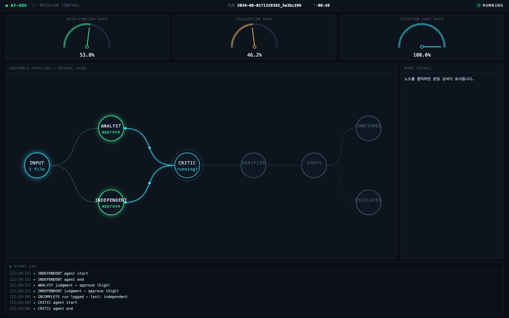

<p align="right"><a href="README.ko.md">한국어</a> | <b>English</b></p>

# AI Governance Template

**A repository template that makes AI judgments verifiable, built on Claude Code.** Following the principle "AI decides, code verifies," it provides an ensemble pipeline of five role-based agents (analyst, independent analyst, critic, evidence-verifier, synthesizer), deterministic hooks that check their output, and a real-time mission-control dashboard.



> Most of this repository's normative content (rubrics, agent instructions, precedents, decision logs) is written in Korean, the language the underlying governance system was authored and audited in. This README explains the system in English; translating the normative documents themselves was intentionally skipped to avoid semantic drift from the text the hooks actually enforce. See the [Korean README](README.ko.md) if you want the native-language walkthrough.

## Purpose

**Make repeated AI judgments reproducible and auditable.** The judgment itself is still made by AI, but whether it followed the schema, whether its evidence actually exists in the source text, and whether the same data produces the same conclusion are checked deterministically by code instead of by a human eyeballing every output. Points of disagreement are automatically routed to a human, and that human's ruling becomes a precedent that grounds future judgments.

## When to use this template

**The question that matters: will this type of judgment repeat, maybe across different people, maybe with the result acted on automatically?**

| Situation | Recommendation |
|---|---|
| A one-off judgment you need right now | Skip this template. Just ask Claude directly. |
| A judgment type that repeats, or gets split across multiple people (expense approval, refund approval, content-report review, support-ticket triage, contract-clause review, etc.) | Use this template. You don't need golden sets and regression on day one, though; start with a single rubric file, and backfill precedents, golden cases, and regression once escalations actually start piling up. |
| Judgments whose outcome is executed automatically (e.g. auto-issuing a refund), or that different people will make at different times and need to agree | This is exactly what the template is built for. Without reproducibility, evidence, and an audit trail, the output can't be trusted. |

Everything this template adds in weight (rubrics, hooks, golden sets, regression, the `--no-ff` branch convention) exists to answer one requirement: when a verdict is disputed or drifts, you need to trace why in code. A one-off judgment never creates that requirement, so it never needs the machinery.

## The problem this template solves

Once you start letting an LLM make judgments like "should this expense be approved?" or "does this content violate policy?", three questions come up fast.

- **Reproducibility** — if you feed the same data in again, do you get the same conclusion, or does it drift?
- **Evidence** — is the verdict actually grounded in what the source document says, or just a plausible-sounding narrative?
- **Verification** — when a conclusion looks wrong, can you tell whether it's a model error or a gap in the norm (the rubric) itself?

This template answers all three **with code, not vibes.** Schema compliance and citation authenticity are checked deterministically by hooks, reproducibility is measured with golden-set regression, and points of disagreement are automatically escalated to a human and accumulated as precedent.

## Core concepts

| Concept | Location | Role |
|---|---|---|
| **Rubric** | `normative/rubrics/` | A closed list of verdict values and the criteria behind them. Humans define in writing what counts as approve/reject/needs_review. |
| **Hooks** | `.claude/hooks/` | Deterministically check whether judgment output follows the schema and whether citations actually exist in the source text. Block with exit 2 on violation. |
| **Golden set** | `golden/cases/`, `golden/run_regression.py` | A collection of cases with known correct answers. Re-running the same input measures whether conclusions reproduce reliably. |
| **Precedent** | `knowledge/precedents/` | A record of what a human decided, and why, when agents' conclusions diverged. Only documents with `status: approved` can be cited as grounds for future judgments. |

**Norms (`normative/`) and knowledge (`knowledge/`) are kept separate.** Schemas, rubrics, and evidence policy are normative assets that cannot be changed without a PR and passing regression tests. Precedents, design decisions, and hypotheses are knowledge assets that humans edit freely. Analyst-type agents never read `knowledge/` at all, so a judgment can't be contaminated by past precedent.

## Pipeline

```
input data
  ├─→ analyst ─────┐
  └─→ independent ─┴─→ critic ─→ verifier ─→ synthesizer ─→ auto-confirmed
                                                          └─→ human escalation
```

The analyst and independent-analyst judge the same data independently, each unaware of the other's result. The critic looks for grounds to object to both conclusions, the verifier checks every judgment's citations, and the synthesizer combines only the judgments that pass verification to decide whether they converge. Disagreement is treated not as an error but as a signal to route to a human. Authority is separated by role: the critic cannot revise a conclusion, and the synthesizer cannot perform new analysis.

## Quick start

```bash
git clone https://github.com/hy0in/ai-governance-template ai-governance
cd ai-governance
python3 -m venv .venv && .venv/bin/pip install jsonschema

claude
```

In the Claude Code session:

> Follow the ensemble-orchestration skill's procedure to run the ensemble pipeline.
> Input: golden/cases/case-000-sample/input/expense-001.md
> Rubric: normative/rubrics/expense-review.md

The analyst and independent-analyst judge in isolation → the critic raises objections → the verifier checks evidence → the synthesizer renders a convergence verdict, and a run record is written to `manifests/`. Start this in another terminal to watch it live, as in the screenshot above:

```bash
python3 dashboard/serve.py   # http://127.0.0.1:8765
```

## Worked example

This template ships with a real case where judgments diverged, and how that was resolved. [Precedent case-001](knowledge/precedents/case-001.md) is a case where conclusions diverged on the same input because of ambiguous rubric wording. [Precedent case-002](knowledge/precedents/case-002.md) is a case where an obviously-correct case was escalated five runs in a row because of gaps in the norms (retroactive rubric application, absence of precedent, the independence-discount rule). Both link the full path from human judgment to normative revision end to end: manifests, escalation documents, and the final precedent.

## Applying this to real work

1. Copy `normative/rubrics/_TEMPLATE.md` to write your actual rubric.
2. Write 20–50 golden cases (`golden/cases/`) from anonymized copies of real data.
3. Confirm reproducibility with the regression harness (`golden/run_regression.py --repeat 5`).
4. When an escalation happens, have a human decide, record it as a precedent, and revise the rubric if needed.

For detailed procedures, the regression bar, dashboard internals, and manifest aggregation rules, see [docs/operations.md](docs/operations.md) (Korean).

## Requirements

- [Claude Code](https://code.claude.com/docs) CLI
- Python 3.9+ (`dashboard/serve.py`, `golden/run_regression.py`, and all hooks use only the standard library — `jsonschema` is only needed for full schema validation in the hooks; without it, they fall back to a required-field check)

## CI

`.github/workflows/` runs hook syntax checks and a golden-set `--dry` check on PRs that touch `normative/` or `.claude/`. **The real regression (`run_regression.py --repeat 5`) does not run in CI.** It needs `claude` CLI authentication and takes real wall-clock time, so a human always runs it locally before merging.

## License

[MIT](LICENSE)
